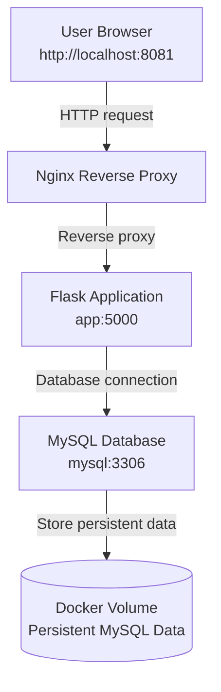
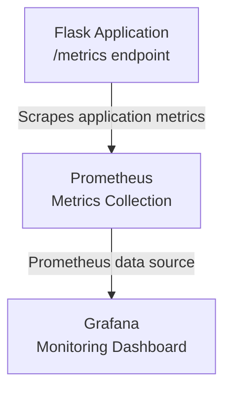
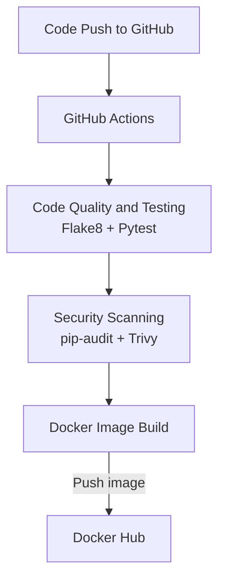
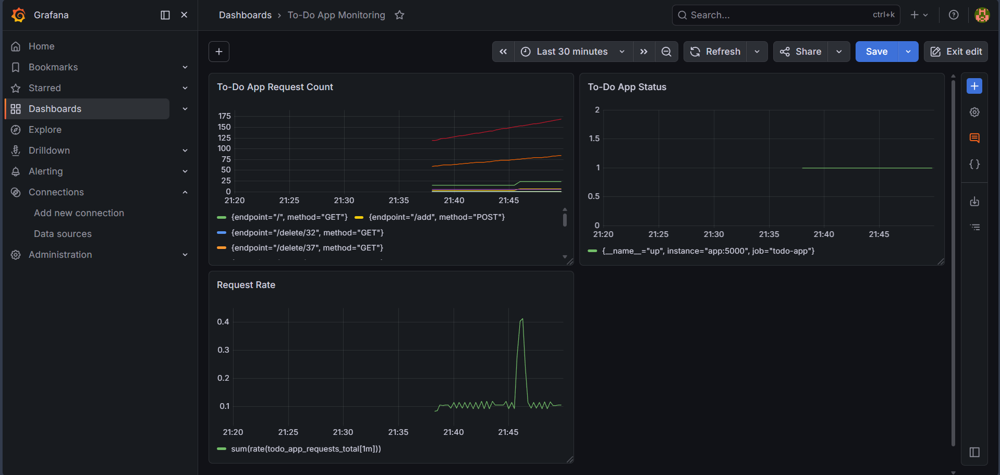
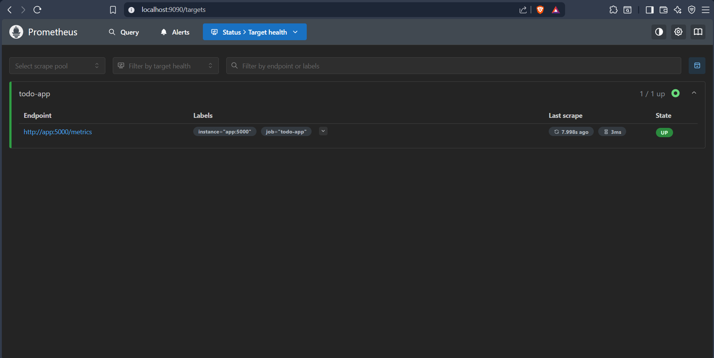

# Containerized Full-Stack To-Do Application

A full-stack To-Do Management Application built with **Python Flask, MySQL, Nginx, Docker Compose, GitHub Actions, Docker Hub, Prometheus, and Grafana**.

This project demonstrates containerization, reverse proxy routing, database persistence, CI/CD automation, security scanning, Docker image publishing, health checks, logging, and monitoring.

---

## Tech Stack

| Category | Technology |
|---|---|
| Backend | Python Flask |
| Application Server | Gunicorn |
| Database | MySQL 8.0 |
| Reverse Proxy | Nginx Alpine |
| Containerization | Docker |
| Multi-container Setup | Docker Compose |
| CI/CD | GitHub Actions |
| Image Registry | Docker Hub |
| Code Quality | Flake8 |
| Unit Testing | Pytest |
| Dependency Security Scan | pip-audit |
| Image Security Scan | Trivy |
| Monitoring | Prometheus |
| Visualization | Grafana |

---

## Project Overview

This is a containerized To-Do web application built to demonstrate a practical DevOps workflow.

Users can add, view, update, and delete tasks through a browser. The application runs as a multi-container setup using Docker Compose.

The project includes:

- Flask application backend
- MySQL database with persistent storage
- Nginx reverse proxy
- Docker Compose multi-container setup
- GitHub Actions CI/CD pipeline
- Docker Hub image publishing
- pip-audit and Trivy security scanning
- Prometheus and Grafana monitoring

---

## Architecture Flow

### Application Flow



### Monitoring Flow



### CI/CD Flow



---

## Features

- To-Do task add, view, update, and delete functionality
- Flask backend served using Gunicorn
- MySQL database integration
- Persistent MySQL storage using Docker volume
- Nginx reverse proxy configuration
- Multi-container deployment using Docker Compose
- Environment-based configuration using `.env`
- Health endpoint for service validation
- Metrics endpoint for Prometheus
- GitHub Actions CI/CD workflow
- Docker image push to Docker Hub
- Dependency scanning using pip-audit
- Docker image scanning using Trivy
- Grafana dashboard for application monitoring

---

## Project Structure

```text
todo-app/
├── app/
│   ├── main.py
│   ├── db.py
│   ├── requirements.txt
│   └── templates/
│       └── index.html
├── mysql/
│   └── init.sql
├── nginx/
│   └── nginx.conf
├── monitoring/
│   ├── prometheus.yml
│   └── grafana/
├── tests/
│   └── test_app.py
├── .github/
│   └── workflows/
│       └── docker-ci.yml
├── screenshots/
├── Dockerfile
├── docker-compose.yml
├── .dockerignore
├── .env.example
├── .gitignore
└── README.md
```

---

## How to Run Locally

```bash
git clone https://github.com/jayvaisakh/todo-app.git
cd todo-app
cp .env.example .env
docker-compose up --build -d
docker-compose ps
```

Access the application:

```text
http://localhost:8081
```

Stop containers:

```bash
docker-compose down
```

Remove containers and volumes:

```bash
docker-compose down -v
```

---

## Screenshots

### Application UI

<a href="screenshots/app-home.png">
  
</a>

### Docker Compose Services

<a href="screenshots/docker-compose-ps.png">
  
</a>

### GitHub Actions CI/CD

<a href="screenshots/github-actions.png">
  
</a>

### Docker Hub Image Tags

<a href="screenshots/dockerhub-tags.png">
  
</a>

### Grafana Monitoring Dashboard

<a href="screenshots/grafana-dashboard.png">
  
</a>

<details>
<summary>Additional project proof screenshots</summary>

### MySQL Database Table

<a href="screenshots/mysql-tasks-table.png">
  
</a>

### Docker Images

<a href="screenshots/docker-images.png">
  
</a>

### pip-audit Dependency Scan

<a href="screenshots/pip-audit.png">
  
</a>

### Trivy Image Scan

<a href="screenshots/trivy-github-actions.png">
  
</a>

### Health Endpoint

<a href="screenshots/health-endpoint.png">
  
</a>

### Nginx Logs

<a href="screenshots/nginx-logs.png">
  
</a>

### Prometheus Targets

<a href="screenshots/prometheus-targets.png">
  
</a>

</details>

---

## Monitoring

Monitoring is implemented using Prometheus and Grafana.

```text
To-Do App    → http://localhost:8081
Prometheus  → http://localhost:9090
Grafana     → http://localhost:3000
```

The Flask application exposes metrics at:

```text
/metrics
```

Prometheus scrapes metrics inside the Docker network from:

```text
app:5000/metrics
```

Useful PromQL queries:

```promql
up{job="todo-app"}
sum by (endpoint, method) (todo_app_requests_total)
sum(rate(todo_app_requests_total[1m]))
```

---

## CI/CD Pipeline

GitHub Actions workflow file:

```text
.github/workflows/docker-ci.yml
```

Pipeline steps:

1. Checkout repository
2. Set up Python
3. Install dependencies
4. Run Flake8
5. Run Pytest
6. Run pip-audit
7. Build Docker image
8. Scan Docker image using Trivy
9. Login to Docker Hub
10. Push Docker image to Docker Hub

Workflow link:

```text
https://github.com/jayvaisakh/todo-app/actions
```

---

## Security Scanning

| Tool | Purpose |
|---|---|
| pip-audit | Scans Python dependencies for known vulnerabilities |
| Trivy | Scans Docker images for vulnerabilities |

Security practices used:

- `.env` excluded from Git
- `.env.example` added for safe configuration sharing
- Application container runs as a non-root user
- Dependencies scanned using pip-audit
- Docker image scanned using Trivy

---

## Useful Commands

Check health endpoint:

```bash
curl http://localhost:8081/health
```

Check metrics:

```bash
curl http://localhost:8081/metrics | grep todo_app_requests_total
```

Run unit tests:

```bash
docker-compose run --rm app sh -c "cd /app && python -m pytest -q -p no:cacheprovider tests"
```

Run Flake8:

```bash
docker-compose run --rm app flake8 /app
```

Run pip-audit:

```bash
docker-compose run --rm app pip-audit
```

View logs:

```bash
docker-compose logs --tail=20 app
docker-compose logs --tail=20 nginx
```

---

## Docker Hub

Docker Hub repository:

```text
jayvaisakh/todo-app
```

Pull latest image:

```bash
docker pull jayvaisakh/todo-app:latest
```

---

## Key Learning Outcomes

- Built a full-stack Flask and MySQL application
- Containerized the application using Docker
- Managed multiple services using Docker Compose
- Configured Nginx as a reverse proxy
- Used Docker volumes for MySQL persistence
- Automated CI/CD using GitHub Actions
- Published Docker images to Docker Hub
- Added security scans using pip-audit and Trivy
- Added monitoring using Prometheus and Grafana

---

## Future Improvements

- Add more unit tests
- Add user authentication
- Add task priority and due date
- Add automated database backup
- Add HTTPS with SSL if hosted publicly

---

## Links

- GitHub Repository: [todo-app](https://github.com/jayvaisakh/todo-app)
- GitHub Actions: [Workflow Runs](https://github.com/jayvaisakh/todo-app/actions)
- Docker Hub Repository: [jayvaisakh/todo-app](https://hub.docker.com/r/jayvaisakh/todo-app)

---

## Author

**Vaisakh Jayan**

<p align="left">
  <a href="https://github.com/jayvaisakh">
    
  </a>
  <a href="https://hub.docker.com/u/jayvaisakh">
    
  </a>
  <a href="https://medium.com/@jaynvaisak">
    
  </a>
</p>

---


