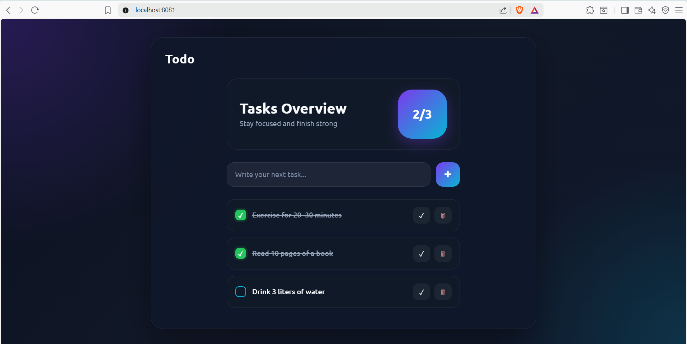
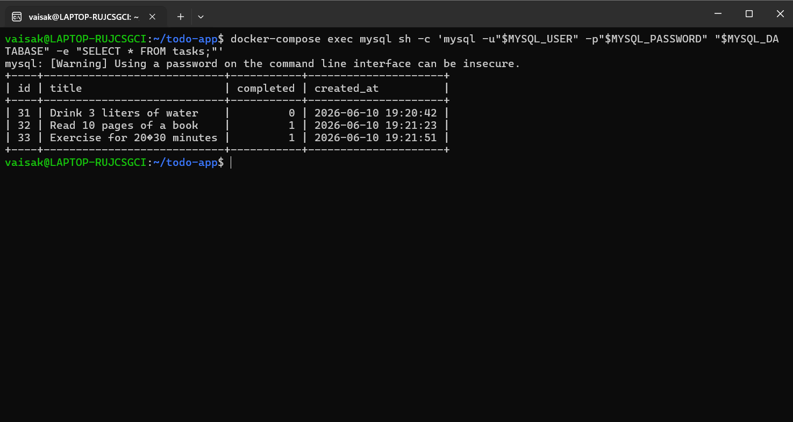
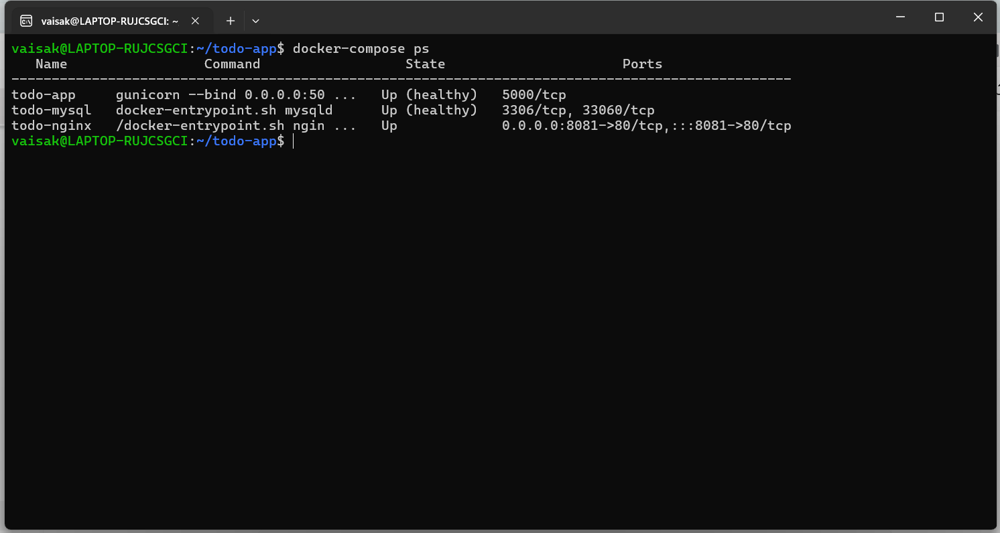
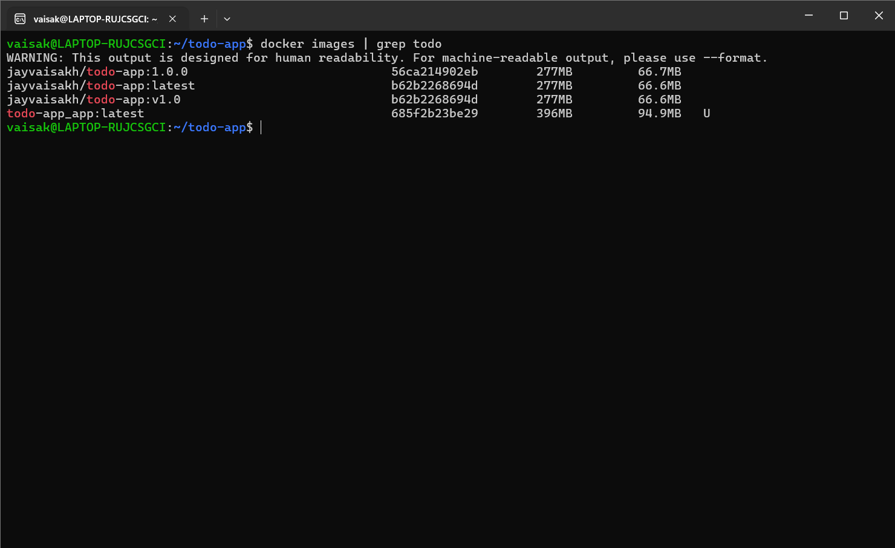
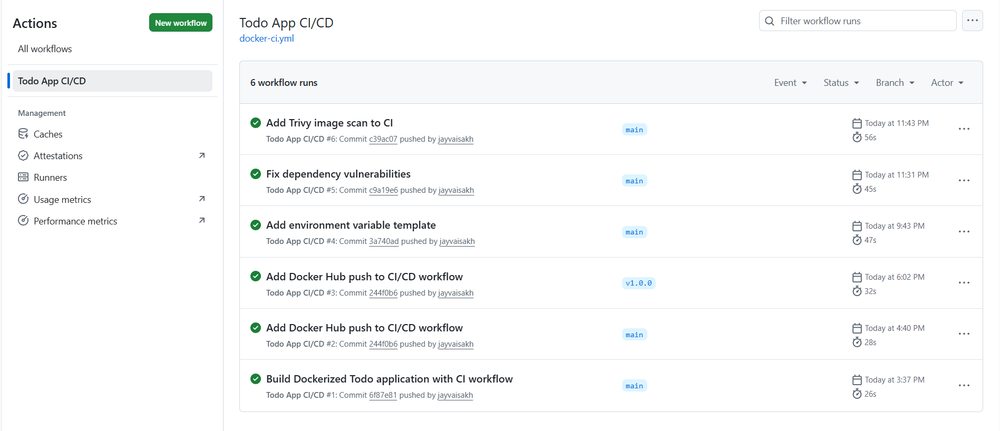
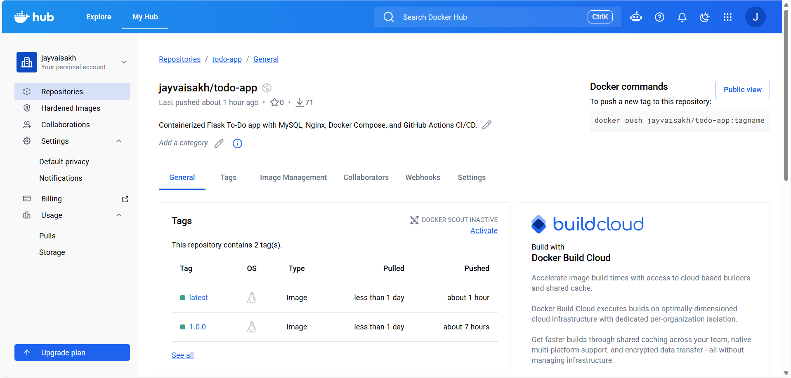
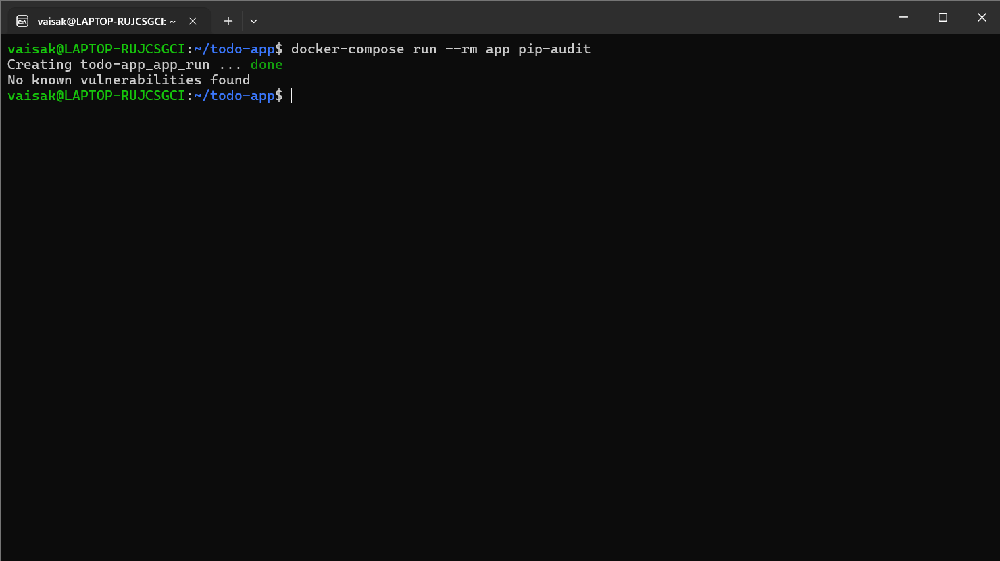
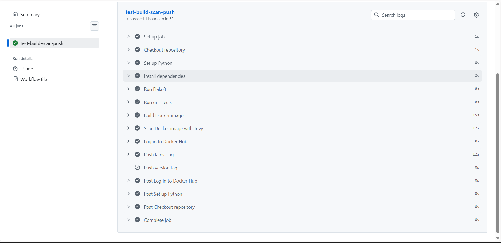
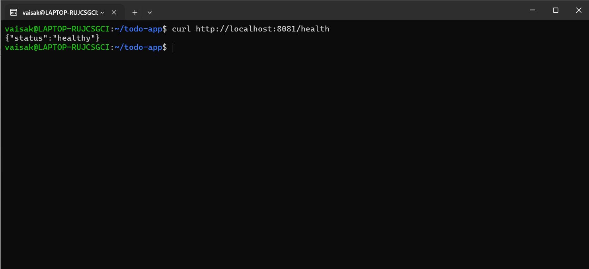
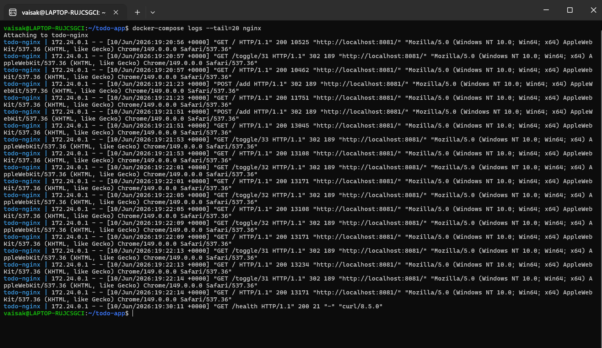

# Containerized Full-Stack To-Do Application

A production-ready full-stack To-Do Management Application built using **Python Flask**, **MySQL**, **Nginx**, **Docker**, **Docker Compose**, **GitHub Actions**, and **Docker Hub**.

This project demonstrates full application containerization, database persistence, reverse proxy configuration, CI/CD automation, Docker image publishing, security scanning, health checks, and logging.

---

## Project Objective

The objective of this project is to design, develop, containerize, and deploy a production-ready To-Do Management Application using Python, MySQL, Docker, Docker Compose, GitHub Actions, and Docker Hub.

---

## Project Overview

This application allows users to:

- Add new tasks
- View all tasks
- Mark tasks as completed or pending
- Delete tasks
- Store task data permanently in MySQL
- Access the application through an Nginx reverse proxy

---

## Tech Stack

<p align="left">
  
  
  
  
  
  
  
  
  
  
  
</p>

| Component | Technology |
|---|---|
| Backend | Python Flask |
| Database | MySQL 8.0 |
| Reverse Proxy | Nginx Alpine |
| Application Server | Gunicorn |
| Containerization | Docker |
| Multi-container Deployment | Docker Compose |
| CI/CD | GitHub Actions |
| Image Registry | Docker Hub |
| Unit Testing | Pytest |
| Code Quality | Flake8 |
| Dependency Security Scan | pip-audit |
| Image Security Scan | Trivy |

---

## Architecture

```text
User Browser
    |
    | http://localhost:8081
    v
Nginx Reverse Proxy Container
    |
    | app:5000
    v
Flask Application Container
    |
    | mysql:3306
    v
MySQL Database Container
    |
    v
Persistent Docker Volume
```

---

## Project Structure

```text
todo-app/
├── app/
│   ├── main.py
│   ├── db.py
│   ├── requirements.txt
│   └── templates/
│       └── index.html
├── mysql/
│   └── init.sql
├── nginx/
│   └── nginx.conf
├── tests/
│   └── test_app.py
├── .github/
│   └── workflows/
│       └── docker-ci.yml
├── screenshots/
│   ├── app-home.png
│   ├── mysql-tasks-table.png
│   ├── docker-compose-ps.png
│   ├── docker-images.png
│   ├── github-actions.png
│   ├── dockerhub-tags.png
│   ├── pip-audit.png
│   ├── trivy-github-actions.png
│   ├── health-endpoint.png
│   └── nginx-logs.png
├── Dockerfile
├── docker-compose.yml
├── .dockerignore
├── .env.example
├── .gitignore
└── README.md
```

---

## Screenshots

### 1. Application UI



### 2. MySQL Database Table



### 3. Docker Compose Services



### 4. Docker Images



### 5. GitHub Actions CI/CD



[View GitHub Actions Workflow](https://github.com/jayvaisakh/todo-app/actions)

### 6. Docker Hub Image Tags



[View Docker Hub Repository](https://hub.docker.com/r/jayvaisakh/todo-app)

### 7. pip-audit Dependency Scan



### 8. Trivy Image Scan in GitHub Actions



### 9. Health Endpoint



### 10. Nginx Logs



---

## Features Implemented

### 1. Application Development

- Built a To-Do application using Python Flask
- Implemented task add, delete, and complete/pending features
- Used HTML template for frontend UI
- Added `/health` endpoint for monitoring

### 2. Database Layer

- Used MySQL 8.0 as the backend database
- Created database initialization script
- Stored task data persistently
- Used Docker volume for MySQL data persistence

### 3. Dockerization

- Created a multi-stage Dockerfile
- Used `python:3.12-slim` base image
- Installed dependencies using `requirements.txt`
- Used Gunicorn as production server
- Configured non-root user execution
- Added Docker health check
- Used `.dockerignore` to optimize build context

### 4. Docker Compose Deployment

Docker Compose includes:

- Python Flask application service
- MySQL database service
- Nginx reverse proxy service
- Persistent MySQL volume
- Custom Docker bridge network
- Environment-based configuration using `.env`

### 5. CI/CD Integration

GitHub Actions pipeline performs:

- Repository checkout
- Python setup
- Dependency installation
- Code quality check using Flake8
- Unit testing using Pytest
- Docker image build
- Trivy Docker image scan
- Docker Hub login
- Docker image push with `latest` and version tags

### 6. Docker Hub Integration

Docker image is pushed automatically to Docker Hub.

Docker Hub repository:

```text
jayvaisakh/todo-app
```

Available tags:

```text
latest
1.0.0
```

### 7. Security Enhancements

Security practices implemented:

- `.env` file used for secrets
- `.env` excluded from Git using `.gitignore`
- `.env.example` added for safe configuration sharing
- Application container runs as non-root user
- Python dependencies scanned using `pip-audit`
- Docker image scanned using Trivy in GitHub Actions
- Vulnerable package versions updated

### 8. Monitoring and Logging

Monitoring and logging implemented using:

- Flask `/health` endpoint
- Docker health checks
- MySQL health check
- `docker-compose ps` container status
- Nginx access logs
- Docker container logs

---

## Environment Variables

Create `.env` from `.env.example`.

```bash
cp .env.example .env
```

Example `.env` file:

```env
MYSQL_ROOT_PASSWORD=rootpassword
MYSQL_DATABASE=todo_db
MYSQL_USER=todo_user
MYSQL_PASSWORD=todo_password
MYSQL_HOST=mysql
MYSQL_PORT=3306
```

---

## How to Run Locally

### 1. Clone the Repository

```bash
git clone https://github.com/jayvaisakh/todo-app.git
cd todo-app
```

### 2. Create Environment File

```bash
cp .env.example .env
```

Update `.env` values if needed.

### 3. Build and Start Containers

```bash
docker-compose up --build -d
```

### 4. Check Container Status

```bash
docker-compose ps
```

Expected result:

```text
todo-app     Up (healthy)
todo-mysql   Up (healthy)
todo-nginx   Up
```

### 5. Access the Application

Open in browser:

```text
http://localhost:8081
```

---

## Health Check

Check the application health through Nginx:

```bash
curl http://localhost:8081/health
```

Expected output:

```json
{"status":"healthy"}
```

---

## Database Verification

Check stored tasks directly from MySQL:

```bash
docker-compose exec mysql sh -c 'mysql -u"$MYSQL_USER" -p"$MYSQL_PASSWORD" "$MYSQL_DATABASE" -e "SELECT * FROM tasks;"'
```

---

## Running Unit Tests

Run Pytest inside the app container:

```bash
docker-compose run --rm app sh -c "cd /app && python -m pytest -q -p no:cacheprovider tests"
```

---

## Code Quality Check

Run Flake8:

```bash
docker-compose run --rm app flake8 /app
```

---

## Dependency Security Scan

Run pip-audit:

```bash
docker-compose run --rm app pip-audit
```

Expected result:

```text
No known vulnerabilities found
```

---

## Docker Image Scan

The Docker image is scanned using Trivy inside GitHub Actions.

Trivy scan is executed after Docker image build and before pushing the image to Docker Hub.

Workflow step:

```text
Scan Docker image with Trivy
```

---

## Docker Hub

Pull the latest image:

```bash
docker pull jayvaisakh/todo-app:latest
```

Pull the versioned image:

```bash
docker pull jayvaisakh/todo-app:1.0.0
```

---

## CI/CD Workflow

GitHub Actions workflow file:

```text
.github/workflows/docker-ci.yml
```

Pipeline triggers on:

- Push to `main`
- Pull request to `main`
- Version tags like `v1.0.0`

GitHub Actions workflow:

```text
https://github.com/jayvaisakh/todo-app/actions
```

---

## Useful Docker Commands

Start containers:

```bash
docker-compose up -d
```

Stop containers:

```bash
docker-compose down
```

Rebuild application image:

```bash
docker-compose build app
```

View container status:

```bash
docker-compose ps
```

View Nginx logs:

```bash
docker-compose logs --tail=20 nginx
```

View app logs:

```bash
docker-compose logs --tail=20 app
```

---

## Future Improvements

- Add Prometheus and Grafana dashboards
- Add more unit tests for add, delete, and update task flows
- Add frontend static file optimization
- Add cloud deployment using AWS, Azure, or GCP
- Add HTTPS using SSL certificate

---

## Author

**Vaisakh J**

<p align="left">
  <a href="https://github.com/jayvaisakh" target="_blank">
    
  </a>

  <a href="https://www.linkedin.com/in/jayvaisakh/" target="_blank">
    
  </a>

  <a href="https://medium.com/@jaynvaisak" target="_blank">
    
  </a>
</p>
